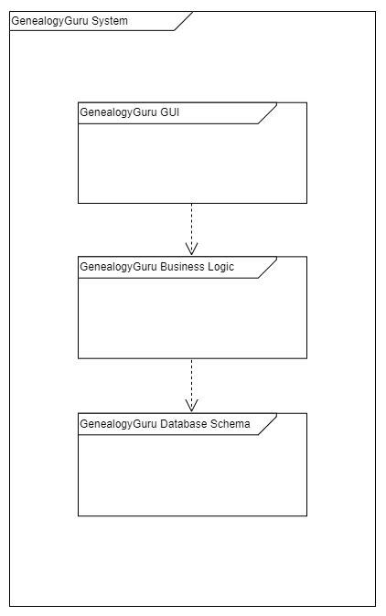
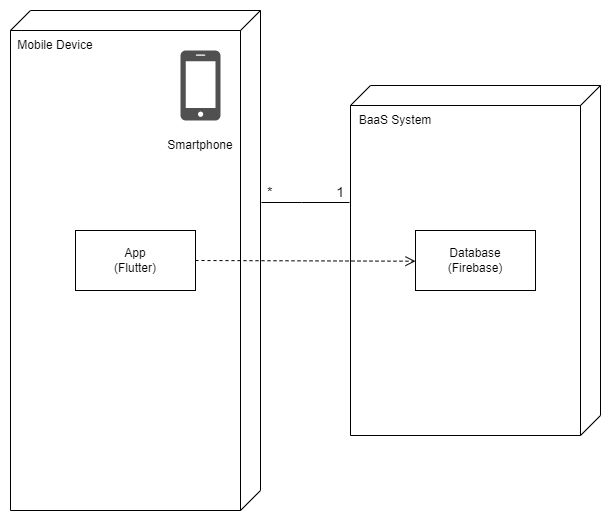
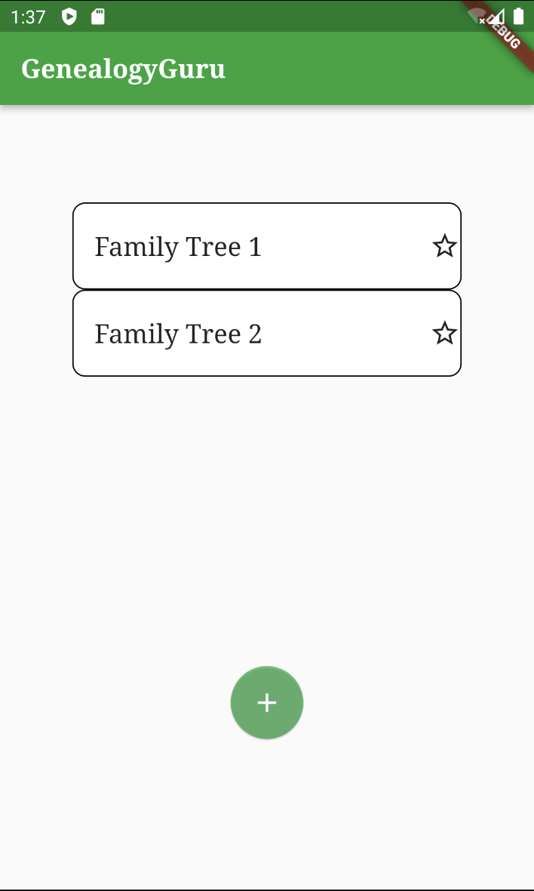

## Architecture and Design

<a name="logical">
  
## Logical Architecture

### Description:

- #### GenealogyGuru GUI
    Package with all of the code related to the Graphic User Interface that will be presented to users.
    
- #### GenealogyGuru Business Logic
    Contains the code for data processing, application flow and user input validation.
    
- #### GenealogyGuru Database Schema
    Connection between the Firebase database and our app, to store all of user's data about the trees and login.
  

</a>
<a name="physical">
 
## Physical Architecture

### Description:

Our app's physical architecture includes only two technologies: the Firebase database to store users' information and the app itself, created using Flutter, which the user interacts with.

</a>
<a name="vertical">
  
## Vertical Prototype

The feature we have implemented is the ability to create new trees and having them appearing on the screen, although nothing else can be done with them.

</a>
