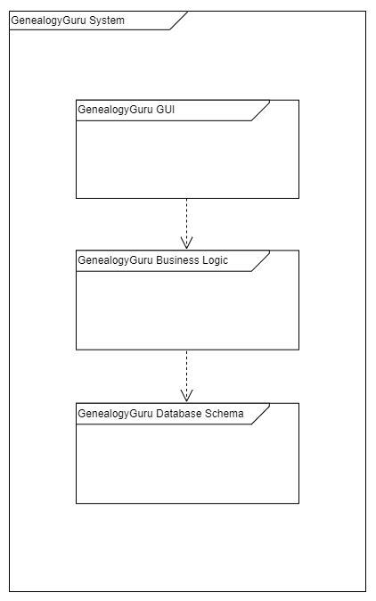
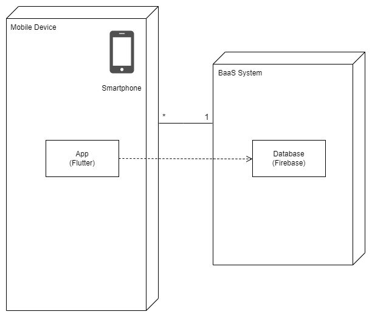

## Architecture and Design
<a name="logical">
### Logical Architecture

</a>
<a name="physical">
### Physical Architecture

</a>
<a name="vertical">
### Vertical Prototype

The feature we have implemented is the ability to create new trees and having them appearing on the screen, although nothing else can be done with them.

</a>
