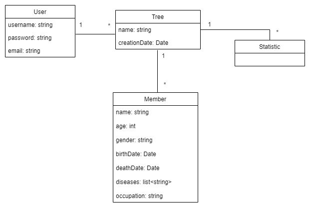

## Requirements

### Domain Model

- **User**: Class representing an user and his login information.
- **Tree**: Class representing an user's tree.
- **Member**: Class representing a certain tree member.
- **Statistic**: Associative class representing the trees' statistics.

